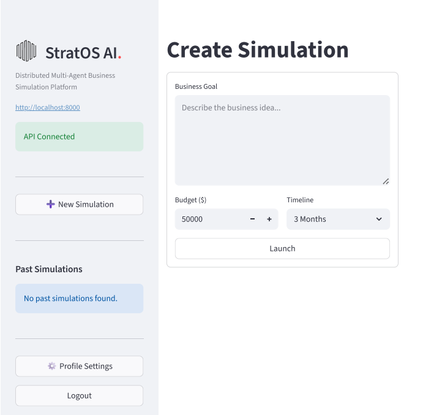
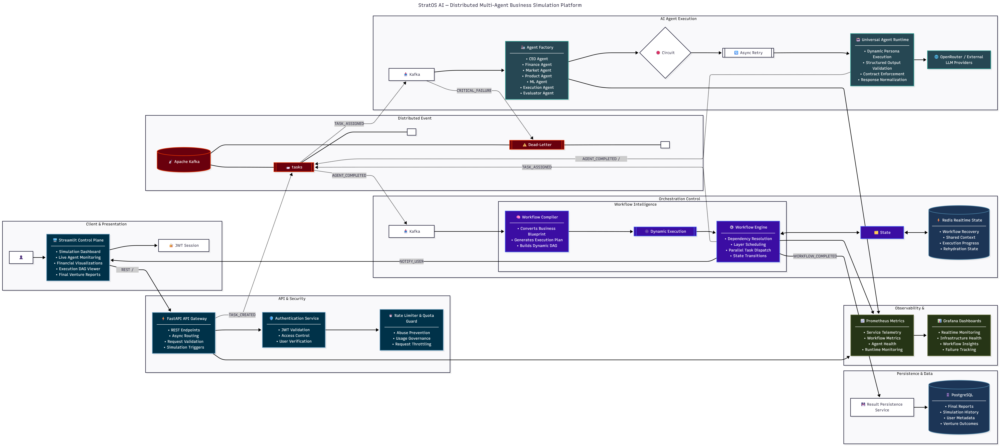
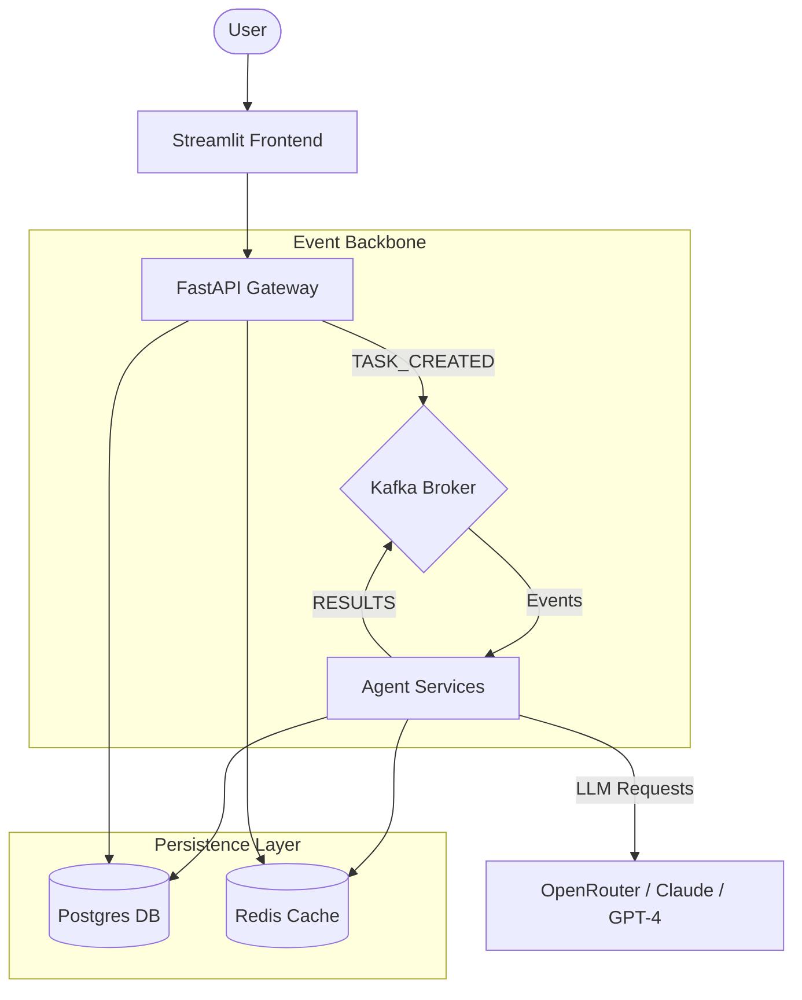

# 🧠 StratOS AI: Distributed Multi-Agent Business Simulation Platform

StratOS AI is a high-fidelity, event-driven business simulation platform that utilizes a swarm of specialized AI agents to architect, analyze, and project the lifecycle of a business venture. From technical architecture to SaaS economics and risk assessment, StratOS AI provides venture-grade insights through a resilient, distributed pipeline.


## 📸 Gallery

<p align="center">
  
</p>

## 🎬 Product Demo

<p align="center">
  <video width="100%" controls>
    <source src="assets/demo_video.webm" type="video/webm">
    Your browser does not support the video tag.
  </video>
</p>


> [!TIP]
> You can also use a high-quality GIF if you prefer auto-playing demos on the main page.

## 🚀 Key Features

- **Distributed Orchestration**: Scalable multi-agent workflow powered by **Kafka** and **Redis**.
- **Specialized Agent Swarm**:
    - **Architect**: Designs the multi-layer execution plan.
    - **Market Specialist**: Conducts competitive analysis and TAM/SAM/SOM modeling.
    - **Technical Architect**: Designs the stack and infrastructure.
    - **Financial Engine**: Projects SaaS economics, burn rate, and ROI.
    - **Risk Evaluator**: Identifies operational and market dependencies.
- **Real-time Streaming**: Live agent activity stream and progress tracking via Streamlit.
- **Enterprise Hardening**: Secure authentication, personal API key management, and robust error recovery.

---

StratOS AI is built on a modern microservices architecture designed for high throughput and fault tolerance.

<p align="center">
  
</p>

### 🛰️ System Flow (Mermaid)



---

## 🛠️ Tech Stack

- **Frontend**: Streamlit, Custom CSS
- **Backend**: FastAPI (Python 3.10+)
- **Message Broker**: Apache Kafka
- **Database**: PostgreSQL
- **Caching**: Redis
- **LLM Orchestration**: OpenRouter API
- **Containerization**: Docker & Docker Compose

---

## 📥 Setup Instructions

### Prerequisites
- Docker & Docker Compose
- [OpenRouter API Key](https://openrouter.ai/keys)

### 1. Clone the Repository
```bash
git clone https://github.com/your-username/StratOS-AI.git
cd StratOS-AI
```

### 2. Configure Environment
Create a `.env` file in the root directory based on `.env.example`:
```bash
cp .env.example .env
```
Edit `.env` and add your `OPENROUTER_API_KEY` and other credentials.

### 3. Launch with Docker
```bash
docker-compose up --build
```

The platform will be available at:
- **Frontend**: `http://localhost:8501`
- **API Gateway**: `http://localhost:8000`

---

## 🚢 Deployment Guide

### Production Hardening
1. **Secrets Management**: Ensure `SECRET_KEY` and database passwords in `.env` are randomized.
2. **Kafka Tuning**: Adjust `KAFKA_MESSAGE_MAX_BYTES` for large simulation narratives.
3. **Database**: Use a managed Postgres instance (like AWS RDS or Neon) for production persistence.

### Vercel/Cloud Deployment
The API Gateway can be deployed to any container registry (Google Cloud Run, AWS Fargate), and the Streamlit frontend can be hosted on Streamlit Cloud or a dedicated VPS.

---

## 📜 License
This project is licensed under the MIT License - see the [LICENSE](LICENSE) file for details.

---

*Built for the future of automated business intelligence.*
